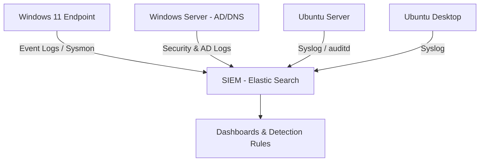

<h1 align="center">🖥️ SOC Home Lab — Build & Log Forwarding Plan</h1>
<h3 align="center">Phase 1: Environment Setup- Getting logs flowing before the SIEM goes in</h3>

  
  
  

---

## 📋 Purpose

To ensure a SIEM generates meaningful alerts, it must first receive consistent, well-configured log data. This document addresses **Stage 1** of my SOC lab build: setting up the operating systems and configuring each one to send logs when the SIEM is introduced in the next phase.

---

## 🧱 Lab Inventory — Virtual Machines

| # | OS | Role in Lab | Purpose |
|---|---|---|---|
| 1 | **Windows 11** | Endpoint / Workstation | Simulates a user endpoint where phishing, malware execution, and user-behavior events originate |
| 2 | **Windows Server** | Domain Controller / Server | Active Directory, DNS, authentication logs, the "crown jewel" logs in most real SOCs |
| 3 | **Ubuntu Server** | Linux Server | Simulates backend/infra services — SSH, sudo, and service logs | "Where the Elastic Stack SIEM is located and where Kibana and Logstash are configured."
| 4 | **Ubuntu (Desktop Image)** | Linux Endpoint | Comparison point to the Windows endpoint cross-platform log normalization practice |

> All VMs run on **VirtualBox**, networked on an internal/host-only adapter so traffic stays isolated from my home network.

---

## 🌐 Planned Network Layout

The SIEM box itself isn't built this phase yet; it's about making sure every VM is *ready to forward* the moment it's introduced.

---

## ⚙️ Per-OS Configuration Plan

### 🪟 Windows 11 (Endpoint)
**Goal:** Capture process creation, network connections, and user activity at the endpoint level.

- Install **Elastic Agent/Defend (Native EDR Telemetry)** with a solid config to log:
  - Process creation (Event ID 1)
  - Network connections (Event ID 3)
  - Image/DLL loads (Event ID 7)
  - Security log
  - Sysmon operational log
  - PowerShell operational log

- Enable **PowerShell Script Block Logging** (catches obfuscated/malicious scripts)
  
---

### 🪟 Windows Server (Domain Controller)
**Goal:** Capture authentication and directory-service events, the backbone of most SOC detections.

- Enable **Advanced Audit Policy** (not just legacy auditing):
  - Logon/Logoff events (4624, 4625, 4634)
  - Account management (4720, 4726, etc.)
  - Kerberos ticket events (4768, 4769) — useful for later detecting things like Kerberoasting
- Enable **DNS debug/analytic logging** for visibility into resolution requests
- Same **Elastic Agent/Defend (Native EDR Telemetry)** plan as the Windows 11 box, pointed at:
  - Security log
  - DNS Server log
  - Directory Service log

---

### 🐧 Ubuntu Server
**Goal:** Capture authentication, privilege escalation, and service-level activity.

- Configure **rsyslog** to centralize local logs (`/var/log/auth.log`, `/var/log/syslog`)
- Install **auditd** for deeper visibility:
  - `sudo`/`su` usage
  - File integrity on sensitive paths (`/etc/passwd`, `/etc/shadow`)
- **Elastic Agent/Defend (Native EDR Telemetry)**, forwarding:
  - `auth.log`
  - `syslog`
  - `audit.log`

---

### 🐧 Ubuntu Desktop (Image)
**Goal:** A lighter-weight Linux endpoint for comparison against the Windows 11 box.

- Same **rsyslog** baseline as the server
- **Elastic Agent/Defend (Native EDR Telemetry)** forwarding auth
- Used mainly to practice normalizing Linux vs. Windows log formats once they hit the SIEM

---

## ✅ Readiness Checklist (before SIEM is introduced)

- [ ] Elastic Agent/Defend (Native EDR Telemetry) installed & configured on Windows 11
- [ ] Advanced Audit Policy enabled on Windows Server
- [ ] Elastic Agent/Defend (Native EDR Telemetry) installed on both Windows boxes (not yet pointed anywhere)
- [ ] auditd installed & rules applied on Ubuntu Server
- [ ] Elastic Agent/Defend (Native EDR Telemetry) installed on both Ubuntu boxes (not yet pointed anywhere)
- [ ] All 4 VMs confirmed reachable on the internal lab network
- [ ] Static IPs assigned to each VM for consistent log source identification

---

## 📚 Resources I'm Using

### Sysmon & Windows Logging
- [Sysmon (Microsoft Sysinternals)](https://learn.microsoft.com/en-us/sysinternals/downloads/sysmon)
- [SwiftOnSecurity Sysmon Config](https://github.com/SwiftOnSecurity/sysmon-config)
- [Olaf Hartong's Sysmon Modular Config](https://github.com/olafhartong/sysmon-modular)
- [Microsoft — Advanced Audit Policy Configuration](https://learn.microsoft.com/en-us/windows-server/identity/ad-ds/plan/security-best-practices/audit-policy-recommendations)
- [Windows Security Event Log Encyclopedia (Ultimate Windows Security)](https://www.ultimatewindowssecurity.com/securitylog/encyclopedia/)

### Linux Logging
- [rsyslog Documentation](https://www.rsyslog.com/doc/)
- [Linux auditd Guide (Red Hat)](https://access.redhat.com/documentation/en-us/red_hat_enterprise_linux/9/html/security_hardening/auditing-the-system_security-hardening)

### Log Shipping (Elastic Stack)
- [Winlogbeat Reference](https://www.elastic.co/guide/en/beats/winlogbeat/current/index.html)
- [Filebeat Reference](https://www.elastic.co/guide/en/beats/filebeat/current/index.html)
- [Elastic — Ingesting Windows Event Logs](https://www.elastic.co/guide/en/beats/winlogbeat/current/how-winlogbeat-works.html)

### Networking & Lab Setup
- [VirtualBox Networking Modes Explained](https://www.virtualbox.org/manual/ch06.html)
- [Active Directory Home Lab Setup Guide](https://adsecurity.org/?page_id=41)

### Detection Engineering (for later phases)
- [MITRE ATT&CK Framework](https://attack.mitre.org/)
- [Sigma Rules Repository](https://github.com/SigmaHQ/sigma)

> This list will keep growing as the lab progresses — new resources get added as I hit new problems.

---

## 🔜 Next Document: SIEM Introduction

The next write-up in this series will focus on setting up the SIEM (Elasticsearch), linking each Elastic Agent/Defend (Native EDR Telemetry) to it, and creating the initial dashboards and detection rules based on this log data.

---

<i>Part 1 of a multi-part SOC home lab build series.</i>

